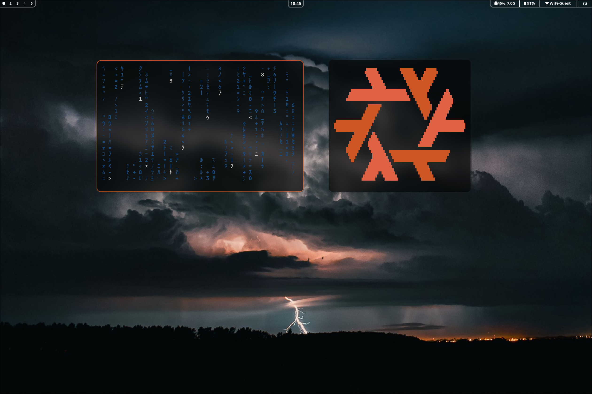
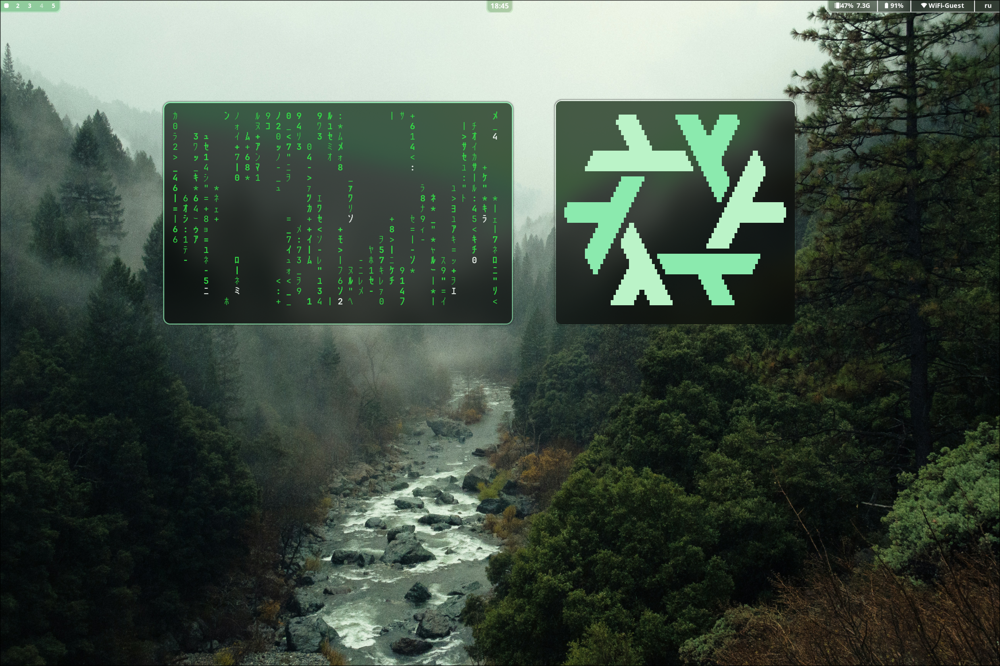
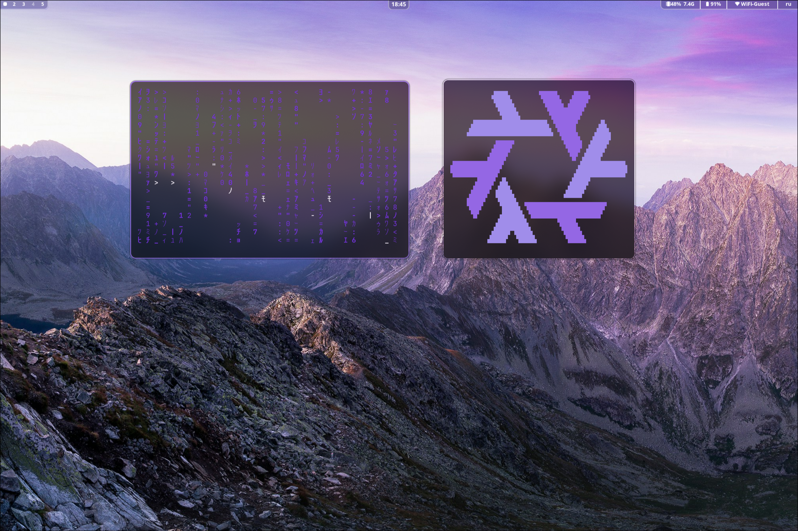

[Русский](#русский) · [English](#english)

# NixOS + Hyprland

**RU:** Это мой конфиг NixOS. За основу я взял конфигурацию другого автора и переработал её под свои задачи. Я хотел сделать рабочий стол одновременно красивым и удобным.

**EN:** This is my NixOS configuration. I started with another person's setup and adapted it to my workflow. My goal was a desktop that looks good and is comfortable to use.

### Скриншоты / Screenshots

Нажмите на изображение, чтобы открыть его в полном размере. / Click an image to view it in full size.

| Гроза / Storm | Лес / Forest | Горы / Mountains |
| :---: | :---: | :---: |
| [](docs/screenshots/storm.png) | [](docs/screenshots/forest.png) | [](docs/screenshots/mountains.png) |

## Русский

### Что внутри

Конфиг рассчитан на NixOS 26.05 и `x86_64-linux`. Он включает Hyprland, Home Manager, SDDM, заставку загрузки Plymouth, оформление рабочего стола и локальные пакеты. Flake-выход называется `nixosConfigurations.example`.

В репозитории нет ничего личного. Ваши имя пользователя и хоста, часовой пояс, язык, раскладка, `stateVersion` и `hardware-configuration.nix` хранятся в папке `local/`. Git её игнорирует, а `update` никогда не трогает.

### Установка

Нужна уже установленная NixOS (x86_64) и пользователь с правами `sudo`. Все команды выполняются от имени этого пользователя, не от root.

**1. Скачайте конфиг.** Клонируйте именно в `~/nixos-config`: по этому пути работают команды `update` и `rebuild` и панель настроек Quickshell. Если Git ещё не установлен, `nix-shell` временно его даст.

```bash
nix-shell -p git --run 'git clone https://github.com/redukeee-hse/nixos-config.git ~/nixos-config'
cd ~/nixos-config
```

**2. Создайте свои настройки.** Скрипт запишет `local/settings.nix` (ваши имя пользователя и хоста, часовой пояс, а из `/etc/nixos/configuration.nix` язык, раскладку и `system.stateVersion`) и скопирует `/etc/nixos/hardware-configuration.nix` в `local/`.

```bash
./scripts/configure-local.sh
```

Другие имя пользователя или хоста: `./scripts/configure-local.sh USERNAME HOSTNAME`. Все параметры: `./scripts/configure-local.sh --help`.

**3. Проверьте настройки.** Откройте `local/settings.nix`; все доступные параметры с пояснениями есть в `local.example/settings.nix`. `stateVersion` должен совпадать с версией NixOS, с которой **ваша** система была установлена изначально. Конфиг использует GRUB в режиме UEFI (`modules/system/boot.nix`); для systemd-boot или BIOS переопределите загрузчик в `local/configuration.nix`.

**4. Соберите и примените.** `build` только собирает систему и ничего не меняет.

```bash
./scripts/rebuild.sh build
```

Если он прошёл без ошибок, запуск без аргументов применяет её.

```bash
./scripts/rebuild.sh
```

Обычный `nixos-rebuild --flake .#example` не увидит папку `local/`, потому что Git её игнорирует. Скрипт передаёт flake как `path:`; вручную это `sudo nixos-rebuild switch --flake path:.#example`.

**5. Перезагрузитесь** и войдите в сессию Hyprland через SDDM. Дальше в терминале доступны команды `update` и `rebuild`.

Если что-то пошло не так, выберите предыдущее поколение в меню загрузчика или выполните `sudo nixos-rebuild switch --rollback`.

### Обновление

```bash
update
```

Команда скачивает последнюю версию из этого репозитория, собирает систему и переключается на неё. Папку `local/` она не меняет. `update --no-switch` только обновляет файлы, применить их можно позже командой `rebuild`.

Свои настройки держите в `local/`, а не в файлах репозитория: `local/configuration.nix` для опций NixOS и `local/home.nix` для Home Manager (примеры в `local.example/`). Если вы всё же правили файлы репозитория, `update` покажет их, сохранит правки патчем в `local/backups/` и вернёт файлы к исходному виду. Ваши собственные коммиты сохраняются и переносятся поверх новой версии; при конфликте `update` ничего не меняет и скажет, как его разрешить.

**Если вы установили конфиг до появления `update`.** В старой версии `configure-local.sh` вписывал ваши данные прямо в файлы репозитория. Один раз выполните:

```bash
cd ~/nixos-config
git fetch origin main
git show origin/main:scripts/update.sh > /tmp/nixos-update.sh
bash /tmp/nixos-update.sh
```

Скрипт перенесёт имя пользователя и хоста, `stateVersion`, часовой пояс, раскладку и `hardware-configuration.nix` в `local/`, сохранит прочие правки патчем в `local/backups/`, обновит конфиг и применит его. После этого достаточно `update`.

### Структура

- `flake.nix`, `flake.lock` — зависимости и конфигурация NixOS.
- `local/` — ваши настройки, не в Git; шаблоны в `local.example/`.
- `hosts/example/` — общая конфигурация хоста.
- `modules/system/` — Nix, загрузчик и Plymouth, сеть, локаль, пользователь и команды `update`/`rebuild`.
- `modules/hardware/` — звук (PipeWire), Bluetooth и питание.
- `modules/desktop/` — Hyprland, вход через SDDM с собственной темой и шрифты.
- `modules/services/` — Docker, nginx, PostgreSQL и Happ.
- `home/example/` — Home Manager и настройки рабочего стола.
- `packages/` — локальные пакеты.
- `scripts/` — `configure-local.sh`, `rebuild.sh` и `update.sh`.

При первой сборке некоторые пакеты скачивают внешние исходники; версии Nix-зависимостей закреплены в `flake.lock`.

## English

### What's included

This configuration targets NixOS 26.05 on `x86_64-linux`. It includes Hyprland, Home Manager, SDDM, a Plymouth boot splash, desktop styling, and local packages. The flake output is `nixosConfigurations.example`.

Nothing personal is in the repository. Your username, hostname, time zone, language, keyboard layout, `stateVersion`, and `hardware-configuration.nix` live in the `local/` folder, which Git ignores and `update` never touches.

### Installation

You need an installed NixOS system (x86_64) and a user with `sudo` access. Run every command as that user, not as root.

**1. Get the config.** Clone it into `~/nixos-config` exactly: the `update` and `rebuild` commands and the Quickshell settings panel use that path. If Git is not installed yet, `nix-shell` provides it temporarily.

```bash
nix-shell -p git --run 'git clone https://github.com/redukeee-hse/nixos-config.git ~/nixos-config'
cd ~/nixos-config
```

**2. Create your settings.** The script writes `local/settings.nix` (your username and hostname, time zone, and the language, keyboard layout, and `system.stateVersion` from `/etc/nixos/configuration.nix`) and copies `/etc/nixos/hardware-configuration.nix` into `local/`.

```bash
./scripts/configure-local.sh
```

For a different username or hostname, run `./scripts/configure-local.sh USERNAME HOSTNAME`. All options: `./scripts/configure-local.sh --help`.

**3. Review your settings.** Open `local/settings.nix`; `local.example/settings.nix` lists every option with comments. `stateVersion` must match the NixOS release **your** system was originally installed with. The config uses GRUB in UEFI mode (`modules/system/boot.nix`); for systemd-boot or BIOS boot, override the bootloader in `local/configuration.nix`.

**4. Build and apply.** `build` only builds the system and changes nothing.

```bash
./scripts/rebuild.sh build
```

If it succeeds, running the script without arguments applies it.

```bash
./scripts/rebuild.sh
```

A plain `nixos-rebuild --flake .#example` cannot see `local/` because Git ignores it. The script passes the flake as `path:`; by hand that is `sudo nixos-rebuild switch --flake path:.#example`.

**5. Reboot** and log in to the Hyprland session from SDDM. From then on, the `update` and `rebuild` commands are available in any terminal.

If something breaks, pick the previous generation in the boot menu or run `sudo nixos-rebuild switch --rollback`.

### Updating

```bash
update
```

This downloads the latest version of this repository, builds the system, and switches to it. It never changes `local/`. `update --no-switch` only updates the files; apply them later with `rebuild`.

Keep your own changes in `local/` rather than in tracked files: `local/configuration.nix` for NixOS options and `local/home.nix` for Home Manager (see the examples in `local.example/`). If you did edit tracked files, `update` lists them, saves the edits as a patch in `local/backups/`, and reverts the files. Your own commits are kept and replayed on top of the new version; on a conflict, `update` changes nothing and tells you how to resolve it.

**If you installed before `update` existed.** The old `configure-local.sh` wrote your details straight into tracked files. Run this once:

```bash
cd ~/nixos-config
git fetch origin main
git show origin/main:scripts/update.sh > /tmp/nixos-update.sh
bash /tmp/nixos-update.sh
```

It moves your username, hostname, `stateVersion`, time zone, keyboard layout, and `hardware-configuration.nix` into `local/`, saves any other edits as a patch in `local/backups/`, updates the config, and applies it. After that, `update` is all you need.

### Layout

- `flake.nix`, `flake.lock`: dependencies and NixOS configuration.
- `local/`: your settings, not in Git; templates in `local.example/`.
- `hosts/example/`: the shared host configuration.
- `modules/system/`: Nix, bootloader and Plymouth, networking, locale, the user account, and the `update`/`rebuild` commands.
- `modules/hardware/`: sound (PipeWire), Bluetooth, and power management.
- `modules/desktop/`: Hyprland, SDDM login with a custom theme, and fonts.
- `modules/services/`: Docker, nginx, PostgreSQL, and Happ.
- `home/example/`: Home Manager and desktop configuration.
- `packages/`: local packages.
- `scripts/`: `configure-local.sh`, `rebuild.sh`, and `update.sh`.

Some packages download external sources on the first build; `flake.lock` pins the Nix dependencies.
